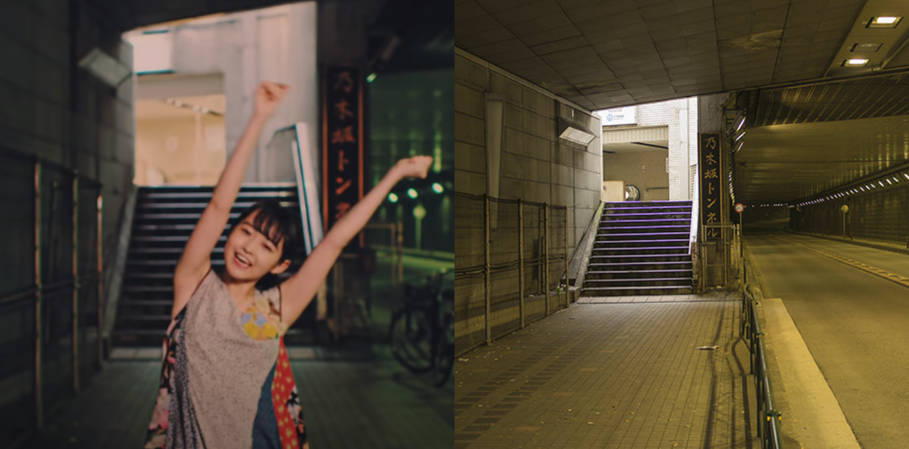

# Marika's Metamorphosis: A Coming of Age Story

Ito Marika is a unique and fascinating individual. She is known for her odd interests, particularly her obsession with moss. She is also a highly experienced ballerina from Kanagawa, and was a member of Nogizaka46 for six years and four months. In 2011, after failing to become a model due to her short stature, Marika decided to take the Nogizaka46 1st gen member audition.

During her time as a Nogizaka46 member, Marika was given the title of the "Queen of Individual PV" by her fans. Coming from a very artistic family - her mother is a fashion designer and her father is a graphic designer - Marika directed and styled several of her individual PVs, which were included in bonus versions of singles and DVDs. These performances are highly regarded by her fans, with Mayo for Nogizaka46's 2nd single Oide Shampoo being a standout example.

<iframe width="560" height="315" src="https://www.youtube.com/embed/V_M9uJ75_Zg" title="YouTube video player" frameborder="0" allow="accelerometer; autoplay; clipboard-write; encrypted-media; gyroscope; picture-in-picture" allowfullscreen></iframe>

Ito Marika's artistic vision and passion for art ultimately led to her first solo art exhibition in October 2017. Held at GALLERY X BY PARCO, the exhibition was titled "伊藤万理華の脳内博覧会 (Ito Marika’s Brain Expo)" and featured a diverse range of artwork, including photographies of her fellow Nogizaka46 members, a room filled with objects meant to represent the contents of Ito's mind, and an original short film playing on loop. This exhibition served as a showcase of Ito's unique perspective and creativity, and was a memorable and successful event for her as she graduated that same year.

Soon, the time to say goodbye arrived, and Marika realized maybe it was finally time to try new things, and as her final artistic act as a Nogizaka46 member, Marika released “はじまりか、(Beginning,)”. “Hajimarika,” is a six-minute musical experience, not being part of Nogizaka46’s discography as graduation songs usually are, the track became free from Yasushi Akimoto’s superficial writing, being instead produced by Setsu Fukushima’s wife, Maki Fukushima.

The song titled “Beginning,” showcases its message starting from its own title. The use of the comma instead of the full stop is significant, graduation does not mean closure, it is a passing point, analogous to the coming of age period, graduation is the first step of an idol towards something new. A scary but priceless change of seasons.

As the song begins, it evokes a sense of tranquility and introspection. The gentle melodies of the piano, paired with Marika's rhythmic monologue, create a soothing atmosphere that envelops the listener. As the song progresses, the orchestra builds in complexity and intensity, reflecting the tumultuous journey of Marika's idol career.

Through her lyrics, Marika candidly shares her struggles of rising from an Under Member to being selected, only to be demoted once again. Her path to becoming an idol was not an easy one, but she persevered through the challenges and eventually found success and happiness within creation.

Despite the hardships, Marika's passion for her craft shines through in every note and lyric. The song serves as a reminder of the dedication and perseverance required to achieve one's dreams. It is a testament to Marika's resilience and determination, and a celebration of her growth, triumphs and the history she wrote in the group.

> “As the first single’s senbatsu was announced, my name wasn’t called.
> What should I do? What is it I lack?
> Lack of confidence. My voice is unstable. Why an idol? Why did I become one?
> Neither my style nor my interests are idol-like at all.”

Marika's lyrics are raw and genuine, giving us an intimate glimpse into her thoughts and feelings during her journey to become an idol. She bares her soul, candidly sharing the challenges and hardships she faced along the way. Through her honest and heartfelt words, Marika provides an authentic and relatable portrayal of the struggles and triumphs of the idol life.

And most importantly, she shows us matureness and humility, by nevertheless thanking her fans for – even with her imperfections – always being by her side, even if she really still does not understand why.

> Even though I am this weird. Thank you for discovering me.
> How can you look at me with that friendly smile?
> Your words really helped me a lot.
> Thank you.
> I’m really grateful to have been part of this.
> These one, two, three, four, five, six years.
> Those are my pride. My youth. I will treasure them for the rest of my life.”

The lyrics of the song are both emotional and powerful, evoking feelings of both joy and sorrow. Marika's honest and candid portrayal of her experiences is both heartwarming and heart-wrenching, and serves as a reminder of the challenges and hardships faced by idols.

The accompanying music video is visually stunning, featuring a graceful and fearless classical ballet dance in the streets of Tokyo. The dance sequence is particularly fitting, as dance plays a significant role in Marika's career.

The moment when the song shifts to a more upbeat tempo, as Marika walks through the Nogizaka Tunnel near the Nogizaka Station, serves as a visual representation of her growth and progress. This moment is particularly poignant, as it showcases Marika's resilience and determination to succeed despite the challenges she faced. Overall, the song and its accompanying visuals create a powerful and moving narrative of Marika's coming of age as an idol.

The ending of the video, with Marika arriving at the final audition venue for Nogizaka46 1st gen members and being surprised by her fans, is particularly fitting. This is the place where Marika's journey as an idol began, and it serves as a poignant reminder of the hard work and dedication that have brought her to where she is today. The inclusion of her fans in this scene adds an extra layer of emotion, as it shows the love and support that have sustained Marika throughout her journey. The ending of "Beginning" is a fitting tribute to Marika's growth and success as an idol, and a celebration of the beginning of her career.

After an idol graduates, we often find ourselves longing for the memories and moments they left with us. We may cling to the words, sounds, or visions of the idol that touched our hearts, but they remain at a distance. rom them, we are left with nostalgia and the urge to revisit what they touched us with, and the sadistic desire for experiencing them going away one more time. We can only hope that they left a fragment of something in us, a lost letter, a smile, or a piece that no one noticed of their soul.

Marika's "Hajimarika" weaves a narrative that is raw and bittersweet, capturing the intimate struggles of her journey as an idol. But within these intimate moments, the PV finds moments of transcendence that draw their power from the unique connection between idols and their fans.

In the end, the magic of "Hajimarika" lies in its exploration of the complex and passionate love story between an artist and her fans. It is a soulful experience that captures the essence of the idol world, and the emotional bonds that connect idols and their fans.

In other words, Marika says:

> That we were able to meet here is a miracle.
> I want to talk to you more. I don’t want it to end here.
> Separating is lonely, but I want you to see a different side of me.
> My future, your future, It would be nice if someday, somewhere, would come to intertwine.

<iframe width="560" height="315" src="https://www.youtube.com/embed/3HV5I2OCbjw" title="YouTube video player" frameborder="0" allow="accelerometer; autoplay; clipboard-write; encrypted-media; gyroscope; picture-in-picture" allowfullscreen></iframe>